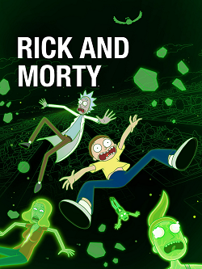

# Rick-and-Morty

## 📋 Description:
* This application saves to the database the characters from the cartoon Rick and Morty.
* The ability to get a random character from the database.
* The ability to find a character by name.
* Also updates the information once in a while.

In this application I use [Rick-and-Morty](https://rickandmortyapi.com/api/character) API.

## 📋 Project structure
#### The project has an 3-Tier Architecture

* Controller - This level allows the user to work with this application.
* Service - This level of architecture is responsible for processing the data received from the DAO level.
* Repository - This level of architecture is responsible for communicating with the database.

## ⚙ Technologies:
* Java 11
* Maven
* Tomcat
* PostgreSQL
* Lombok
* Spring Boot
* Spring-mock-mvc

## 🚀 Quickstart
1. Clone repository
2. Download image with Postgres 15-Alpine from Docker '
3. Download image with Project Rick and Morty from Docker 'docker pull vyushchenko/rick-and-morty'
4. Run project 'docker-compose up'
